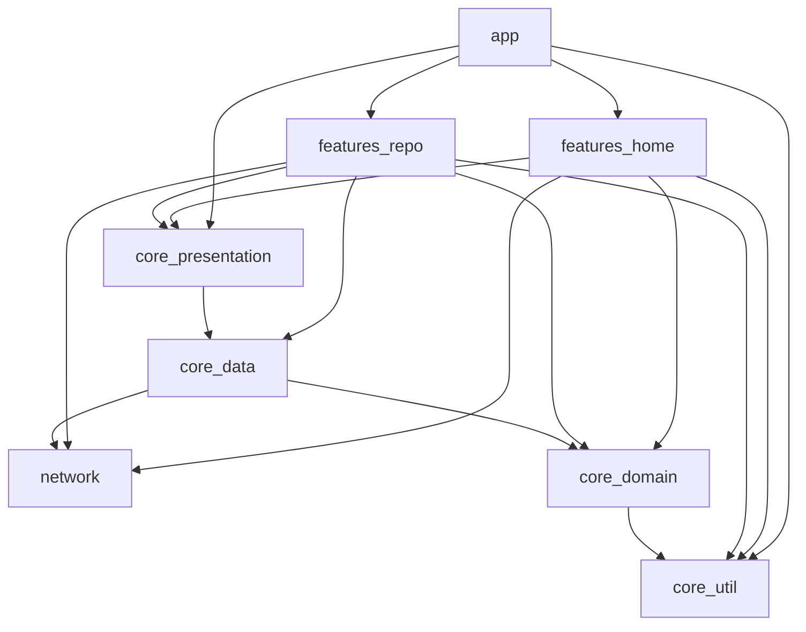

# Github User
A mobile application that allows users to search and explore GitHub users and their repositories with an intuitive, user-friendly interface.
## Project Overview
Build a GitHub client application that enables users to:
-   Search for GitHub users by username.
-   View detailed user profiles and information.
-   Browse a user's repositories.
-   Provide a smooth, responsive user experience.

## Solution Overview
The application follows a clean architecture pattern with two main screens:

### User Search Screen
- Real-time search functionality for Github Users.
- Displays user avatars, usernames.
- Handles search states( loading, errors)
- Smooth navigation to user details.

### Profile Repo Screen
- Shows comprehensive user profile information.
- Displays repository meta(stars, language, description).
- Implements pagination for users with many non-forked repositories.


## Set up Instructions

1. Clone this repository.
 ```
 git clone https://github.com/PhyoLinMg/github-demo
 cd github-demo
 ```
2. Create a `local.properties` file in the root folder:
```
GITHUB_TOKEN= YOUR_GITHUB_PERSONAL_ACCESS_TOKEN
```

### How to get a Github Personal Access Token:
Go to GitHub Settings > Developer settings > Personal access tokens > Tokens (classic)
-   Click "Generate new token (classic)"
-   Select scopes: `public_repo` and `read:user`
-   Copy the generated token and paste it in `local.properties`

## App Architecture and Tech Stack
### Tech Stack
- **Language:** Kotlin
- **Framework:** Jetpack Compose, Android
- **Build Tool:** Gradle
-  **Testing:** JUnit 5
- **Others:** Kotlin Coroutines, Dagger Hilt, Ktor

### App Architecture

## Usage

### API endpoints (if applicable)
- `GET /users` - Displays all public users from Github.
- `GET /users/{username}/repos` - Displays the repositories(non-forked) that the username owns.
- `GET /user` - with Bearer token, it displays the repositories(non-forked) of the owner of the token provided.
- `GET /search/users?q={query}&per_page={perpage}&page={page}` - Search the users' profile with the query


## Screenshots

|Name| Screen                                                                                                                              |
|--|-------------------------------------------------------------------------------------------------------------------------------------|
|Home Screen |                  |
|Profile Screen |            |
|User Profile Screen |  |
|User Search Screen |    |
|Repo Web View |              |


## Design Decisions
### Architecture

**MVVM + Clean Architecture**: The application follows a layered architecture approach:

-   **Presentation Layer**: Activities/Fragments (View) + ViewModels for UI state management
-   **Domain Layer**: Use cases and business logic, independent of frameworks
-   **Data Layer**: Repository implementations with local and remote data sources

This separation ensures:
-   **Testability**: Each layer can be tested independently
-   **Maintainability**: Changes in one layer don't affect others
-   **Scalability**: Easy to add new features or modify existing ones

### Data Management

**Repository Pattern**: Abstracts data sources (GitHub API, local cache) from ViewModels.
-   Single source of truth for data access.
-   Handles caching strategies and offline scenarios.
-   Centralizes error handling and data transformation.

**Singleton Pattern**: Applied to:

-   **API Client**: Ensures single Retrofit instance across the app.
-   **Database**: Single Room database instance for efficient resource usage.
-   **Repository Instances**: Prevents multiple instances and ensures data consistency.

### Error Handling

-   Centralized error handling through sealed classes.
-   Network-specific error mapping (timeout, no internet, API errors).
-   User-friendly error messages with retry mechanisms.


### Performance Considerations
**Multiple Module Gradle Build Performance**: Optimized for faster build times and development efficiency

-   **Configure on Demand**: Only configures modules that are actually needed for the build.
-   **Configuration Cache**: Caches the result of configuration phase to speed up subsequent builds.
-   **Gradle Caching**: Enables build cache to reuse outputs from previous builds.
-   **Parallel Task Configuration**: Allows Gradle to run tasks in parallel when possible.

**Runtime Performance**:
-   **Image Caching**: Coil library with memory and disk caching for user avatars
-   **Lazy Loading**: LazyColumn with ViewHolder pattern for smooth scrolling with paging-compose
-   **Search Debouncing**: 300ms delay to prevent excessive API calls during typing

## Future Improvements
If given more time, these enhancements could be added:

### Feature Improvements
- **Dark mode:** Implement system-aware dark/light theme switching with user preference persistence.
- **Deep Link Screens**
- **Setting Page:**
    - Language filtering and sorting preferences for repositories.
    - Search result preferences (users per page, default sort order).
    - Cache management options
- **Additional error handling**
    -  Comprehensive Exception Management:
        - Network timeout handling with retry mechanisms
        - API rate limit detection with user-friendly messaging
        - Offline state management with cached data fallback
        - Input validation for edge cases.
- **Enhanced Testing coverage**
    -	**Repository Layer:** Unit tests for Github API integration, caching logic and error scenarios.
    -	**ViewModel Layer:** Test state management and data transformation.
    -	**UI Layer:** Testing the UI layouts for interactions, navigation flows, and error state displays.
    -	**Integration Tests:** End-to-end testing of search-to-detail user journeys.
    -	**Target Coverage:** Aim for 80%+ code coverage across all layers.

