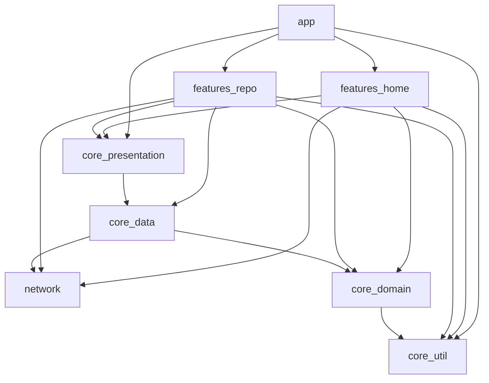

# Github User

## Project Interview

## Set up Instructions

## App Architecture and Tech Stack

## Feature Implemented

## Design Decisions

## Known Issues/Limitations

## ScreenShots

## Libraries

## Unit Test
